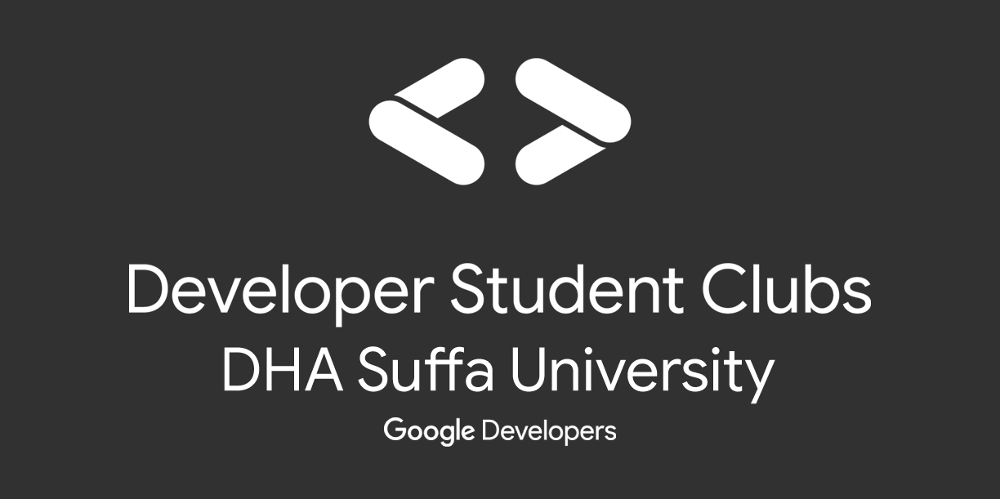

# DSC-DSU

</img>

Main repository containing all relevant documents and codebase for Developer Student Club at DSU powered by Google Developers

## Sessions

- [Version Control With Git](<##Version\ Control\ With\ Git>)
- [Machine Learning Workshop](<##Machine\ Learning\ Workshop>)
- [Python Bootcamp 2020](<##Version\ Control\ With\ Git>)

## Resources

- ## Version Control With Git

  - [Lecture notes](version_control_with_git/lecture_notes.md)
  - [Youtube playlist](https://www.youtube.com/watch?v=oMntxxpwDqA&list=PLLyazdzLgFw7YKIV7tPhwruafPl388OoN)

- ## Machine Learning Workshop

  - [Notebook](machine_learning_workshop/titanic_survival.ipynb)
  - [Youtube playlist](https://www.youtube.com/watch?v=2GfOG5AO0rc)
  - [Workshop Slides](https://docs.google.com/presentation/d/1MF5V6WfjW88ipWDzUKJ1IKoAkKEIn3u3rvJwSBAqIuY/edit#slide=id.ga0a280794d_0_15)

- ## Python Bootcamp 2020
  - [YouTube playlist](https://www.youtube.com/playlist?list=PLLyazdzLgFw4SsqxcJzmoKZ94juVjEJZG&fbclid=IwAR0NGiQMWnytKUn9Je5BP4BWro-hcTxoEbuw8nNNpbECKGKFG6et6yz4-co)
  - [Lecture notes](python_bootcamp_2020/readme.md)
